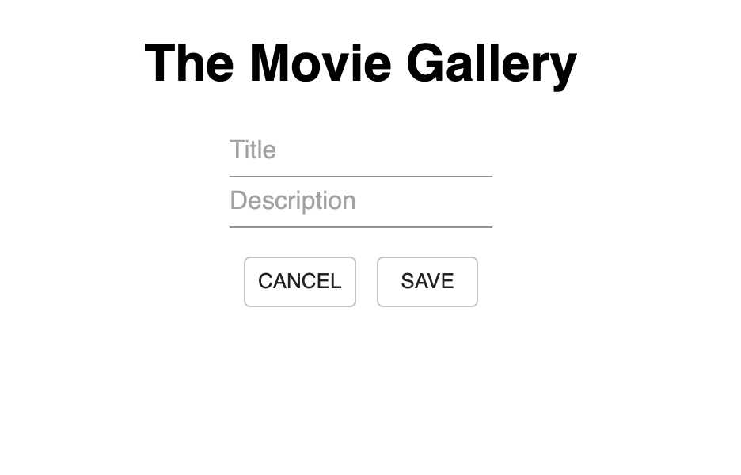

# The Movie Gallery

## Description

Duration: 2 Days

Your project description goes here. What problem did you solve? How did you solve it?
Using the SERN stack, I was able to create an application that sorted movies from a database and displayed it in alphabetical order. Users can edit the title and description of the movies. Improvements to the app of allowing the user to add their own movies coming soon!

<!-- To see the fully functional site, please visit: DEPLOYED VERSION OF APP -->

## Wireframe

Format: 

Format: 

### Prerequisites

https://nodejs.org/en/

## Installation
This is a step by step list for how another developer could get this project up and running.

1. Create a database named saga_movies_weekend,
2. The queries in the tables.sql file are set up to create all the necessary tables and populate the needed data to allow the application to run correctly. The project is built on Postgres, so you will need to make sure to have that installed. We recommend using Postico to run those queries as that was used to create the queries.
3. Open up your editor of choice and run an npm install
4. Run npm run server in your terminal
5. Run npm run client in your terminal
6. The npm run client command will open up a new browser tab for you!

## Usage
You can use this applicaiton to learn more about movies as well as make edits to the description and title of all the listed movies. 

## Built With
-- SERN stack
-- SQL
-- Express
-- React
-- Node
-- Material UI

## Acknowledgement
Thanks to Prime Digital Academy in Minneapolis who equipped and helped me to make this application a reality.

## Support
If you have suggestions or issues, please email me at harrisonnguyen517@gmail.com
